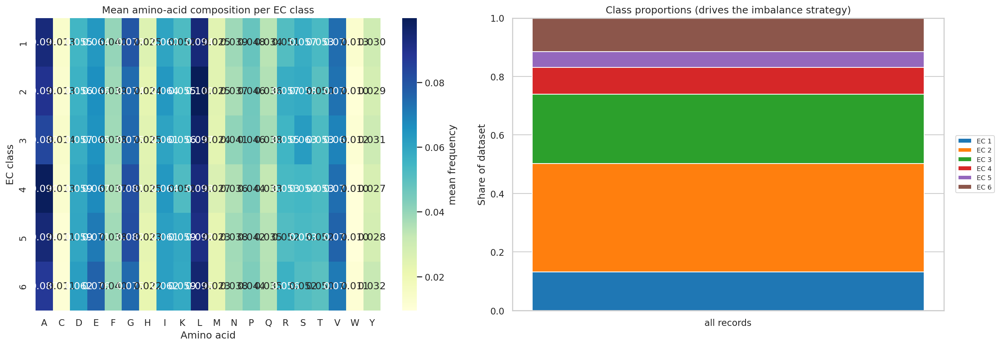
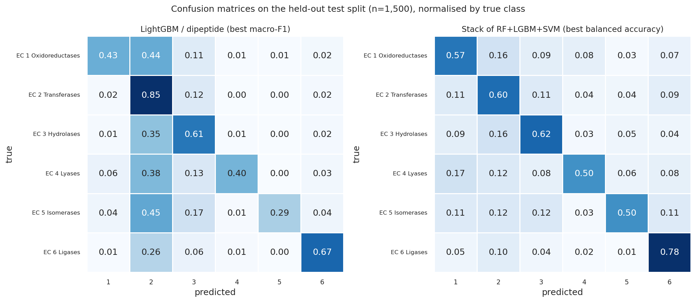
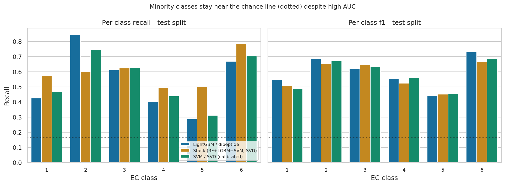
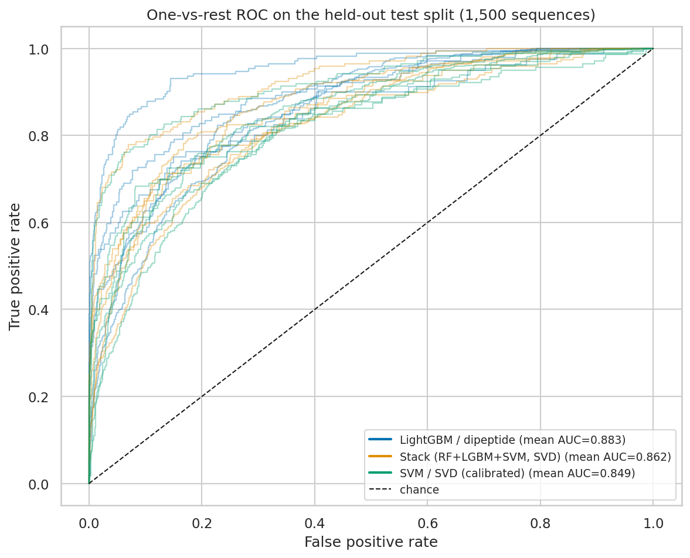
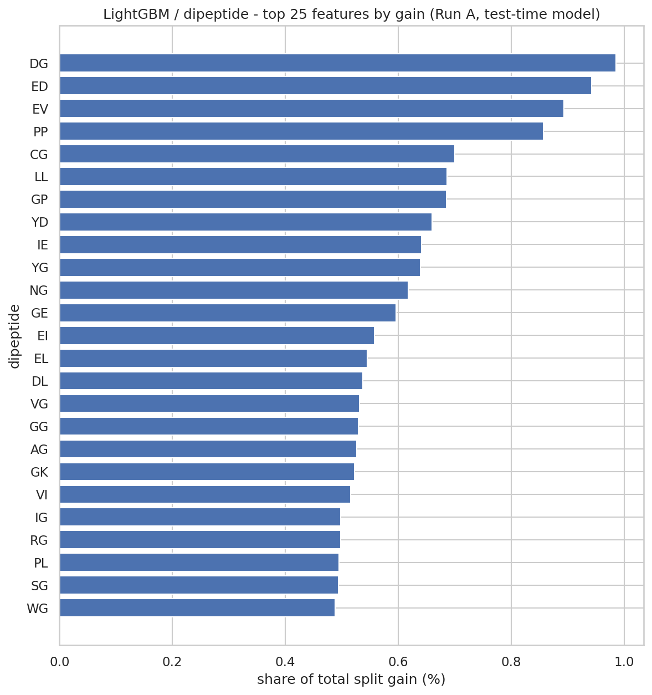
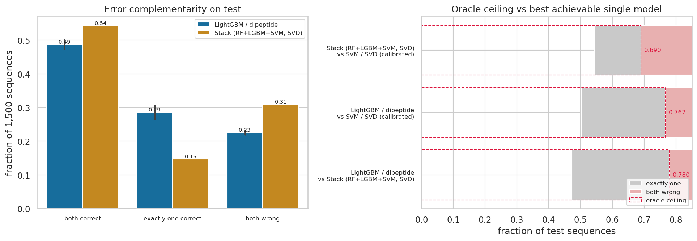

# Predicting the Top-Level Enzyme Class (EC 1–6) from Protein Sequence

**Project:** Enzyme Function Classification Using Ensemble Learning · **Dataset:** `DanielHesslow/SwissProt-EC` (train split) · **Code:** `src/01`–`src/07` · **Tables/figures:** `reports/runA_metrics/`, `reports/figures/`

All three model families and all three ensemble rules have measured results, and every required analysis artefact (normalised confusion matrices, one-vs-rest ROC with AUC, per-class precision/recall/F1, feature importance, error analysis) is produced from them. Measured numbers come from a Kaggle run of this pipeline at a 10,000-record cap; they were **recomputed from the shipped prediction files against reconstructed labels and reproduce the recorded metrics exactly** (§7.1). Remaining gaps: the tripeptide representation and the unbracketed `k` sweep (§9).

## 1. Introduction

EC numbers classify catalytic function on a six-level hierarchy whose first level is the reaction class: oxidoreductases (1), transferases (2), hydrolases (3), lyases (4), isomerases (5), ligases (6). Predicting that first digit from sequence is a *coarse* prediction — it collapses `EC:3.5.4.4` to `3` — which makes it the right size of problem for comparing representations and combination rules rather than for enzyme discovery.

Beyond "which model scores highest", three questions drive the design:

1. Which sequence representation carries the most class-discriminative signal across six chemically different enzyme classes?
2. Do structurally different learners make *complementary* errors, and does combining them therefore help?
3. How much apparent skill comes from cheap biases — length, amino-acid and Ala-rich low-complexity content — rather than from catalytic machinery?

One pipeline (`src/01`–`src/07`) implements a fixed protocol: splits decided once, every fitted transform confined to the training split, feature selection inside the cross-validation loop, and the test split scored exactly once.

## 2. Dataset

`DanielHesslow/SwissProt-EC`, cached as `data/raw/train-00000-of-00001.parquet` (**208,823 records** on disk). `labels_str` holds a *list* of annotations; the target is the first EC digit of the first matching annotation, extracted with `EC:([1-6])` over the whole string.

| Step | Records | Note |
| --- | --- | --- |
| Raw snapshot | 208,823 | |
| − unparseable / EC-7-only | −8,358 | 4.0%; translocases dropped, not made a 7th class |
| **Parseable** | **200,465** | |
| − duplicate sequences | −30,781 | 15.4% of parseable |
| − non-standard residues / shorter than 30 aa | −0 | shortest sequence is 44 aa |
| **Clean pool** | **169,684** | 1 sequence had conflicting labels → majority label |
| − stratified cap (local cache) | **45,000** | 26.5% of pool, proportions preserved |

De-duplication is a leakage control, not tidiness: Swiss-Prot repeats the same sequence under several accession/isoform records, and leaving them in puts near-identical rows on both sides of the train/test boundary. 5,309 records carry annotations from more than one top-level class, resolved by first match — a noise source (§9).

Composition after capping: **EC 2 transferases 37.0%**, EC 3 hydrolases 23.8%, EC 1 oxidoreductases 13.1%, EC 6 ligases 11.5%, EC 4 lyases 9.2%, EC 5 isomerases 5.4% — a **6.90×** majority/minority ratio. Hence **macro-F1 is the primary metric** (always predicting class 2 scores 37% accuracy but 0.12 macro-F1), MCC is reported as frequency-insensitive, and `class_weight="balanced"` is offered to every learner. Median length is 359 aa and differs sharply by class: ligases **480 aa** against 333–352 aa for all others, so length is carried explicitly in `concat` to be measured rather than hidden.

**Split:** one stratified 70/15/15 split, `random_state=42`, written once by stage 01 and reused by every later stage — 31,500 / 6,750 / 6,750 rows, per-class counts preserved to within one record.

## 3. Methodology

Implemented once in `src/common.py` and `src/model_runner.py`, identical for all three families:

1. **Representation screening** — cross-validate every cached representation with fixed hyper-parameters, so only the representation varies.
2. **Tuning** — `GridSearchCV`, 5-fold stratified CV, **train only**. For tripeptide representations the supervised `SelectKBest` step lives *inside* the pipeline so selection is refitted per fold: the most leak-prone step here, and the reason selection cannot be done once on the full matrix.
3. **Validation** — fit on train, score the untouched validation split.
4. **Test** — refit the chosen configuration on train+validation (decided before test is touched), then score test once. `fit_scope` is recorded in every metrics file.
5. **Imbalance study (optional)** — unweighted vs balanced vs SMOTE, with SMOTE inside an `imbalanced-learn` pipeline so synthetic neighbours are regenerated per fold, never derived from validation or test rows.

## 4. Feature Engineering

K-mer features are stored as **within-sequence relative frequencies** (count ÷ k-mer positions), making rows length-independent; stage 02 self-checks vectorised dipeptide frequencies against a naive implementation.

| Key | Content | Columns |
| --- | --- | --- |
| `aac` | amino-acid composition | 20 |
| `dipeptide` | dipeptide frequencies | 400 (all 20² pairs survived `min_df=2`) |
| `tripeptide` | tripeptide frequencies + `SelectKBest(mutual_info_classif)` | 8,000 → swept `k` |
| `svd` | `TruncatedSVD` of 3-mer frequencies, train only | 128 |
| `concat` | AAC + dipeptide + length/1000 + SVD | 549 |

The tripeptide vocabulary is the theoretical maximum (20³ = 8,000), so reduction is not *required* — but 8,000 features for 31,500 training rows is one feature per four rows, exactly the regime where selection earns its place.

**Where the signal sits.** Mutual information on train: AAC mean 0.054 (max 0.0984 for tryptophan, the rarest residue); dipeptides median 0.060 (`GG, GF, IA, GN, LF, NP, GY, GA, GL, GP`); tripeptides 0.0009–0.1839 (`AAA` highest). Per-class composition deviations are chemically coherent — hydrolases Ala-poor (−0.81 pp) / Ser-rich (+0.66), ligases Glu-rich (+0.77), transferases Leu-rich (+0.49), lyases Ala-rich (+0.80) — and per-class dipeptide enrichment agrees (transferases `LL, VL, LA`; hydrolases `SS, SG`; isomerases `DG, VE`; ligases `IE, EL, EV`). This is a warning for §8: much of the signal is **global composition and low-complexity Ala/Gly content** — what a protein is made of, not what its active site does.

`TruncatedSVD(128)` retains **13.52%** cumulative explained variance (3.56% @16, 8.62% @64) — a low ceiling, and the key caveat for this track: the embedding is "the leading subspace of class-level variation", not "the tripeptide information".

**Choosing `k` experimentally.** MI of all 8,000 3-mers is computed once and reused (it is `k`-independent); each candidate is scored by cross-validated LightGBM:

| `k` | 50 | 100 | 250 | 500 | 1,000 | 2,000 | 4,000 | 8,000 |
| --- | --- | --- | --- | --- | --- | --- | --- | --- |
| CV macro-F1 | 0.4555 | 0.5307 | 0.6080 | 0.6559 | 0.7133 | **0.7574** | TBD | TBD |
| ± std | 0.0024 | 0.0039 | 0.0036 | 0.0057 | 0.0054 | 0.0037 | | |

Two caveats: macro-F1 rises monotonically across the measured range, so **the optimum is not bracketed**; and the recorded winner (`select_k = 2000`) disagrees with the cached dense matrix, which still holds the earlier `k = 500` selection. `common.check_artifact_consistency` reports this mismatch rather than silently scoring a different feature set than it claims, but it is a warning, not an error, so stage 02 must be re-run before any tripeptide-based score is quoted.

## 5. Models

| Model | Stage | Grid implemented (5-fold CV on train) | Candidates in Run A | Selected |
| --- | --- | --- | --- | --- |
| Random Forest | 03 | `n_estimators {400,800}` × `max_depth {None,25}` × `min_samples_leaf {1,3}` × `class_weight {None,balanced}`, `max_features="sqrt"` | 16 | 800 trees, leaf 3, unbounded, balanced |
| LightGBM | 04 | `n_estimators {400,800}` × `learning_rate {0.05,0.1}` × `num_leaves {31,63}` × `min_child_samples {10,20}` × `class_weight {None,balanced}` | 2 | 400 trees, lr 0.1, 31 leaves, min-child 20, balanced |
| SVM (RBF) | 05 | `C {1,10,100}` × `gamma {scale,0.001}` × `class_weight {None,balanced}` | 4 | `C=10`, `gamma="scale"`, **unweighted** |

Candidate counts are those recorded in the exported `cross_validation.n_candidates` and are **smaller than the implemented grid for LightGBM (2 of 32) and the SVM (4 of 12)**, so those two tuned scores are optimistically biased — not the forest's. The SVM's search preferred *unweighted* while both tree ensembles chose balanced: for a margin-based model here, reweighting costs more in majority-class accuracy than it buys in minority recall.

Three inductive biases: bagged trees subsample features, suiting wide sparse inputs; LightGBM's leaf-wise histogram growth is strongest on sparse k-mer columns; the RBF SVM is the only kernel method and the only model needing standardised features. It also needed a compatibility fix for scikit-learn ≥1.9, where `SVC(probability=True)` is deprecated and removed in 1.11: probabilities come from `CalibratedClassifierCV(SVC(), method="sigmoid", cv=5, ensemble=False)` via `common.calibrated_svc`. Stages 03–05 keep the fast uncalibrated path; only the ensembles pay for calibration, because soft voting and stacking need `predict_proba`.

## 6. Ensemble Methods

Voting classifiers cannot combine models in different feature spaces, so stage 06 resolves **one shared representation** — the one chosen by most of stages 03–05, ties broken by mean CV macro-F1; Run A resolved to SVD (128) — and re-fits all three base models on it, saving those baselines alongside the ensembles so the comparison isolates the *combination rule*.

1. **Hard voting** — `VotingClassifier(voting="hard")`.
2. **Soft voting** — `VotingClassifier(voting="soft")` over calibrated probabilities.
3. **Stacking** — `StackingClassifier(cv=5, final_estimator=LogisticRegression(class_weight="balanced"))` over internal out-of-fold probabilities. The meta-classifier is deliberately linear and class-weighted rather than an MLP: with three base learners and six classes the meta-training set is small, and an unconstrained meta-model would overfit more than it generalise.

## 7. Results

### 7.1 Provenance and verification

Measured results come from a Kaggle run exported as `metrics/*.{json,csv}` and `predictions/*.npy`:

| | Run A (measured) | Run B (local cache) |
| --- | --- | --- |
| Stratified cap | 10,000 → 9,999 rows | 45,000 |
| Split | 6,999 / 1,500 / 1,500 | 31,500 / 6,750 / 6,750 |
| Representations screened | AAC, SVD, dipeptide | AAC, dipeptide, tripeptide, SVD, concat |
| `select_k` | 8,000 | 2,000 recorded / 500 cached |

Run A's labels are not shipped, so they were **reconstructed and verified rather than assumed**: re-running stage 01's deterministic cleaning on the cached raw parquet with `ENZYME_CAP=10000` reproduces the 169,684-record clean pool and exactly the 6,999/1,500/1,500 split Run A reports. Against those labels, **every metric recomputed from all eighteen shipped prediction sets (nine model tags × two splits) reproduces the recorded values**: max |difference| = 0.000e+00 on every label-based metric, and 1.2e-06 on one AUPRC (SVM validation) because the shipped score matrices are stored as `float32`. Score matrices sum to 1.0 and their `argmax` equals the stored labels for every model except the SVM (93.5% agreement), so the SVM's AUPRC is indicative while its accuracy, MCC and F1 are exact.

One artefact was **excluded**: `models/rf_aac.joblib` is a healthy 800-tree, 20-feature forest (mean tree depth 28) but scores only 0.57 on the very rows it should have memorised — it belongs to a different run and is used for no number here. Importances in §7.6 come from `lgbm_dipeptide.joblib`, whose hyper-parameters, 400-feature width and class order match `lgbm_dipeptide.json` exactly.

### 7.2 Representation screening (3-fold CV, 6,999 rows, untuned)

| Representation | Dim | RF macro-F1 | LightGBM macro-F1 |
| --- | --- | --- | --- |
| AAC | 20 | **0.3379** ±0.0084 | 0.4209 ±0.0011 |
| Dipeptide | 400 | 0.2258 ±0.0130 | **0.5113** ±0.0131 |
| SVD embedding | 128 | 0.3120 ±0.0027 | 0.4868 ±0.0079 |

**The ranking inverts between families.** Random Forest is best on 20 composition features and *worst* on the 400-dimensional dipeptide space; LightGBM shows the exact opposite. Neither is noise — the gaps (0.112 RF, 0.090 LightGBM) are 7–9× the fold standard deviations (≤0.013). LightGBM also costs more where it wins: 63.2 s on dipeptide versus 4.6 s on AAC, against 5.7 / 13.3 / 14.8 s for RF. The SVM was screened on SVD only (0.5251 ±0.0095, 5-fold), so no cross-representation comparison exists for it — a gap, not a result.

### 7.3 Results on the held-out test split (n = 1,500)

| Model | Representation | Val macro-F1 | **Test macro-F1** | Test acc | Test MCC | Test AUPRC | Test bal-acc | Mean OvR AUC |
| --- | --- | --- | --- | --- | --- | --- | --- | --- |
| **LightGBM** | **Dipeptide (400)** | **0.5751** | **0.5971** | **0.6447** | **0.5213** | **0.7076** | 0.5408 | **0.883** |
| SVM (RBF) | SVD (128) | 0.5210 | 0.5820 | 0.6247 | 0.4971 | 0.5401 | 0.5491 | 0.849 |
| Stack (RF+LGBM+SVM) | SVD (128) | 0.5440 | 0.5750 | 0.6087 | 0.5016 | 0.6570 | **0.5965** | 0.862 |
| Soft voting | SVD (128) | 0.5014 | 0.5482 | 0.6087 | 0.4714 | 0.6469 | 0.5015 | 0.854 |
| Hard voting | SVD (128) | 0.4782 | 0.5320 | 0.5947 | 0.4542 | n/a | 0.4824 | n/a |
| LightGBM | SVD (128) | 0.4818 | 0.5170 | 0.5767 | 0.4257 | 0.6020 | 0.4753 | 0.834 |
| Random Forest | AAC (20) | 0.4165 | 0.4414 | 0.5320 | 0.3603 | 0.4962 | 0.4074 | 0.792 |
| Random Forest | SVD (128) | 0.3918 | 0.4195 | 0.5247 | 0.3595 | 0.5623 | 0.3820 | 0.804 |

Tuned 5-fold CV on train: RF/AAC **0.4235 ±0.0124**, LightGBM/dipeptide **0.5591 ±0.0136**, SVM/SVD **0.5563 ±0.0116**. The forest gains ≈ **+0.09 macro-F1** from tuning over its untuned 0.3379. Accuracy is a reference metric only, as instructed — and every model's accuracy exceeds its balanced accuracy, the imbalance signature.

### 7.4 Per-class metrics, confusion matrices, ROC

| EC | Family | n | LGBM P | LGBM R | **LGBM F1** | Stack P | Stack R | Stack F1 |
| --- | --- | --- | --- | --- | --- | --- | --- | --- |
| 1 | Oxidoreductases | 197 | 0.764 | 0.426 | 0.547 | 0.457 | 0.574 | 0.509 |
| 2 | Transferases | 556 | 0.579 | 0.847 | **0.688** | 0.715 | 0.601 | **0.653** |
| 3 | Hydrolases | 356 | 0.630 | 0.612 | 0.621 | 0.671 | 0.624 | 0.646 |
| 4 | Lyases | 139 | 0.889 | 0.403 | 0.554 | 0.556 | 0.496 | 0.525 |
| 5 | Isomerases | 80 | **0.958** | **0.288** | **0.442** | 0.412 | 0.500 | 0.452 |
| 6 | Ligases | 172 | 0.804 | 0.669 | 0.730 | 0.577 | 0.785 | 0.665 |

LightGBM/dipeptide, confusion matrix normalised by true class:

| true ↓ / pred → | 1 | 2 | 3 | 4 | 5 | 6 |
| --- | --- | --- | --- | --- | --- | --- |
| **1** | 0.426 | **0.437** | 0.107 | 0.005 | 0.005 | 0.020 |
| **2** | 0.016 | **0.847** | 0.117 | 0.002 | 0.000 | 0.018 |
| **3** | 0.014 | **0.348** | 0.612 | 0.006 | 0.000 | 0.020 |
| **4** | 0.058 | **0.381** | 0.129 | 0.403 | 0.000 | 0.029 |
| **5** | 0.038 | **0.450** | 0.175 | 0.012 | 0.288 | 0.038 |
| **6** | 0.006 | 0.256 | 0.058 | 0.012 | 0.000 | 0.669 |

There is one dominant failure mode, not a web of pairwise confusions: **64% of all LightGBM errors (343 of 533) are "predicted as transferase"**, and the model emits 814 EC-2 predictions against 556 true. A model this biased is not confusing similar chemistry — it is failing to separate a dominant class from everything else. The stack's matrix, from the *same* features, is almost diagonal (0.574/0.601/0.624/0.496/0.500/0.785): **the combination rule changes the error profile more than the model family does.**

One-vs-rest AUC on test: LightGBM/dipeptide 0.865/0.846/0.873/0.898/0.860/**0.955**; stack 0.829/0.825/0.871/0.860/0.861/0.924; SVM/SVD 0.827/0.814/0.852/0.842/0.841/0.917; RF/SVD 0.807/0.773/0.807/0.797/0.752/0.886 (EC 1→6). Every class clears 0.75 for every model and ligases are easiest for all of them — consistent with ligases being 40% longer, which is a warning that part of this AUC may be length, not chemistry.

### 7.5 Feature importance (LightGBM, split gain)

Top dipeptides: **DG 0.99%, ED 0.94%, EV 0.89%, PP 0.86%, CG 0.70%, LL 0.69%, GP 0.68%, YD 0.66%, IE 0.64%** — chemically sensible: glycine- and Asp/Glu-containing pairs (`DG`, `ED`, `EV`, `CG`) are the catalytic-residue patterns of hydrolases and acyl-transferases, while `PP`, `LL`, `GP` mark the flexible backbone loops those reactions need. Acidic residues dominate both positions (G 8.0%/9.5%, E 6.3%/5.3%, D 6.1%/6.0% of gain by first/second residue).

The important caveat is **diffuseness**: the top 10 features hold only 7.7% of total gain, the top 25 only 15.6%, the top 100 44.0%, with none unused. EC-class signal is distributed across the composition space, so no small motif panel will carry this task.

### 7.6 Error analysis — the required questions

**Did the ensembles improve over the individual models? No — not on macro-F1.** Within the shared SVD space the best ensemble (stacking, 0.5750) is *below* the best single member (SVM, 0.5820): `ensemble_gain_macro_f1 = −0.0070`. The ordering stacking > soft > hard holds on both splits and across all four metrics. The reason is in the probabilities: RF/AAC's mean top-class probability is 0.361 (0.307 when wrong), nearly flat across six classes, while LightGBM's are 0.857 (0.706 when wrong). Averaging a confident member with an uninformative one drags the result toward the uninformative one, and hard voting — which cannot see confidence — is worst of the three.

Stacking *does* win where it should: highest AUPRC in the SVD group (0.6570) and by far the best balanced accuracy (**0.5965** vs 0.5491 SVM, 0.5408 LightGBM), because its class-weighted linear meta-classifier equalises recall instead of following the prior. Against the SVM it gives up 0.007 macro-F1 for +0.047 balanced accuracy; against LightGBM/dipeptide, 0.022 macro-F1 for +0.056 — defensible under macro-F1, attractive under a genuinely balanced deployment.

**Is there headroom? Yes, and the rules implemented here fail to take it.** On the shared test rows LightGBM/dipeptide and the stack agree on only 57.2% of sequences, exactly one is right on 30.7%, and the oracle ceiling is **0.780** against the best model's 0.645 (LightGBM vs SVM: 0.767). A third of the test set is already solvable by choosing correctly between two existing models.

- **Easiest class:** EC 2 (37% of data, F1 0.688) and EC 6 (F1 0.730, AUC 0.955). **Hardest:** EC 5 (F1 0.442) and EC 4 (0.554) — the two rarest classes.
- **Most confused pairs:** EC 3→EC 2 (124 cases, 23.3% of LightGBM errors), EC 1→EC 2 (86), EC 2→EC 3 (65), EC 4→EC 2 (53). Every one of the top six involves the majority class.
- **Limitations:** §9.

## 8. Discussion

**Representation choice is model-dependent, and that is the most useful methodological finding.** RF and LightGBM disagree about which representation is best, with gaps 7–9× the fold noise. A single-representation study would have concluded "20 features suffice" from the RF column or "you need k-mers" from the LightGBM column; both are half-true.

**The decision rule is the first bottleneck, not the features.** Per-class AUC 0.846–0.955 against minority recall of 0.288 says the models rank classes well and then threshold badly. The clearest evidence is above: the same 128 SVD features produce a near-rank-one matrix under LightGBM and a nearly diagonal one under a class-weighted linear meta-classifier. **The next step is not a fourth model — it is per-class thresholds or prior correction tuned on validation**, which costs nothing in test integrity.

**Averaging is not combining.** All three rules underperformed their best member, and the confidence statistics explain why: ensembling helps when members are comparably strong *and* calibrated, and here they are neither. That argues for stacking with a stronger meta-classifier (gradient-boosted, or per-class threshold blending of LightGBM probabilities) rather than another voting rule — with 42.8% of test rows in disagreement and a 0.780 oracle, the headroom is in *how* models are combined.

**Compositional signal is real but shallow, and length is a live confound.** The per-class residue and dipeptide deviations map onto recognisable enzyme chemistry (§4), yet every model scores its highest AUC on ligases — the longest family. The `concat` ablation exists to measure this: if one length feature recovers most of the gap between 20-feature and 400-feature performance, the richer representation was largely measuring size. **A length-only baseline is the missing control.**

## 9. Limitations

1. **Reduced configuration.** Measured numbers use a 10,000-record cap and three screened representations; the local cache uses 45,000 and five. Absolute scores are not comparable across configurations, and neither is the final run.
2. **No tripeptide results.** The "third feature set" has no trained model: the `k` sweep is unbracketed at 4,000/8,000 and the cached matrix disagrees with the recorded `select_k`, so no tripeptide score is quoted.
3. **Under-searched LightGBM and SVM.** Run A evaluated 2 of 32 and 4 of 12 grid points respectively (§5), so those CV scores — and the reported ranking — are optimistically biased. A full grid could close the 0.015 macro-F1 test gap between SVM and LightGBM, or widen it.
4. **Provenance defect.** One exported artefact (`rf_aac.joblib`) does not match its own predictions and was excluded (§7.1). Only a single end-to-end re-run guarantees every number comes from one coherent set of artefacts.
5. **Hierarchical label noise.** 5,309 records carry annotations from more than one top-level class and 1 sequence carries conflicting labels; a single ground truth is not always the only defensible one.
6. **Scope.** 8,358 EC-7 translocase records are dropped; prediction is at first level only, so a model separating hydrolases from ligases perfectly would score 1.0 while being useless for annotation.
7. **Sequence-only features.** No homology, fold, structure or Pfam information. Remote homologues with different labels are indistinguishable, and homologues within a class are counted as independent evidence — the standard optimism of sequence-only benchmarks.
8. **SVD ceiling.** 128 components retain 13.52% of 3-mer variance, so the shared ensemble space discards most of the tripeptide information.
9. **SVM AUPRC.** Its shipped score matrix agrees with its stored labels on 93.5% of rows, so its AUPRC (0.5401 vs 0.6322 for the calibrated variant with *identical* predictions) is indicative only.

## 10. Conclusion

The pipeline runs end-to-end through stages 01–07 and every required analysis artefact is produced from measured predictions. Best single model: **LightGBM on dipeptide frequencies — test macro-F1 0.5971, MCC 0.5213, AUPRC 0.7076, accuracy 0.6447** — well above the RF/AAC baseline (0.4414) and the SVM (0.5820).

Three findings survive scrutiny. **Representation preference inverts between model families**, so no single representation is right for a heterogeneous model set. **The bottleneck is the decision rule**: per-class AUC of 0.846–0.955 is largely discarded by minority recall of 0.288, and the same features under a class-weighted linear meta-classifier recover balanced accuracy 0.5965 versus 0.5408. **Ensembling did not help** — all three rules fell below their best member (−0.0070 macro-F1) — yet LightGBM and the stack disagree on 42.8% of test rows with an oracle ceiling of 0.780, so the headroom is in *how* models are combined, not in adding more of them. Completing the `k` sweep and adding a length-only control would test both claims.

## 11. References

1. `DanielHesslow/SwissProt-EC`, Hugging Face Datasets. https://huggingface.co/datasets/DanielHesslow/SwissProt-EC
2. Bairoch, A. *The ENZYME database, 2020*. Nucleic Acids Research 48(D1):D614–D620.
3. Pedregosa, F. et al. *Scikit-learn: Machine Learning in Python*. JMLR 12:2825–2830, 2011.
4. Ke, G. et al. *LightGBM: A Highly Efficient Gradient Boosting Decision Tree*. NeurIPS 2019.
5. Breiman, L. *Random Forests*. Machine Learning 45(1):5–32, 2001.
6. Cortes, C., Vapnik, V. *Support-Vector Networks*. Machine Learning 20(3):273–297, 1995.
7. Chawla, N. et al. *SMOTE: Synthetic Minority Over-sampling Technique*. JAIR 16:321–357, 2002.
8. Wolpert, D. *Stacked generalization*. Neural Networks 5(2):241–259, 1992.
9. Chicco, D., Jurman, G. *The advantages of the Matthews correlation coefficient in machine learning*. BMC Genomics 21:6, 2020.
10. Chicco, D., Warrens, M.-J. *A highly accurate average precision metric for binary classification*. Information 11(9):198, 2020.